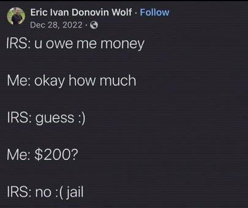

```{r setup, include=FALSE}
knitr::opts_chunk$set(echo=TRUE, message=FALSE, warning=FALSE, error=FALSE)
library(magick)
```

```{css}
body {
    font-size: 14pt;
    font-family: Arial;
    color: white;
    background-color: black;
}

pre {
    background-color: pink;
    color: blue;
    padding: 5px;
}
```

## Project requirements
I have met the requirements related to working with GitHub. Within the README, [my Github repo](https://github.com/ls-ron/stats220) contains a main header first stating that this is my first project for Stats220. Then I used normal text to show that I knew how to use italics. After that would be my use of a ordered list. To finish off the main header I talk about my hope that the course will teach me about R markdown and HTML/CSS, in bold. Once that's done my second and smaller header contains an unordered list of links to my other repos on my GitHub, my Linkedin, and the current weather in Auckland. A shameless plug if you will.

[Proof of my files and that R studio is set up](project_files_proof.png)


## My meme


I changed the background colour, the position of the text, and some of the words/grammar used within the meme. I also changed it so that it says "Chat with IRS opened"

```{r meme-code, eval=TRUE}
# recreating the first text square
square_one <- image_blank(405, 100, "black") %>%
  image_annotate(text = "Chat with IRS opened",
                 color = "white",
                 size = 40,
                 font = "Impact",
                 gravity = "center"
                 )

# recreating the second text square
square_two <- image_blank(405, 100, "black") %>%
  image_annotate(text = "IRS: You owe me money",
                 color = "white",
                 size = 30,
                 font = "Sans",
                 gravity = "west"
                 )

# recreating the third text square
square_three <- image_blank(405, 100, "black") %>%
  image_annotate(text = "Me: Okay, how much?",
                 color = "white",
                 size = 30,
                 font = "Sans",
                 gravity = "east"
                 )

# recreating the fourth text square
square_four <- image_blank(405, 100, "black") %>%
  image_annotate(text = "IRS: Guess :p",
                 color = "white",
                 size = 30,
                 font = "Sans",
                 gravity = "west"
                 )

# recreating the fifth text square
square_five <- image_blank(405, 100, "black") %>%
  image_annotate(text = "Me: Uhh, $250?",
                 color = "white",
                 size = 30,
                 font = "Sans",
                 gravity = "east"
                 )

# recreating the sixth text square
square_six <- image_blank(405, 100, "black") %>%
  image_annotate(text = "IRS: Wrong D: jail",
                 color = "white",
                 size = 30,
                 font = "Sans",
                 gravity = "west"
                 )

# stacking the six squares on top of each other using a vector
square_vector <- c(square_one, square_two, square_three, square_four, square_five, square_six)

# finished meme:
image_append(square_vector, stack = TRUE)

```


```{r animation-code, eval=FALSE}
# recreating the first text square
square_one <- image_blank(405, 100, "black") %>%
  image_annotate(text = "Chat with IRS opened",
                 color = "white",
                 size = 40,
                 font = "Impact",
                 gravity = "center"
                 )

# recreating the second text square
square_two <- image_blank(405, 100, "black") %>%
  image_annotate(text = "IRS: You owe me money",
                 color = "white",
                 size = 30,
                 font = "Sans",
                 gravity = "west"
                 )

# recreating the third text square
square_three <- image_blank(405, 100, "black") %>%
  image_annotate(text = "Me: Okay, how much?",
                 color = "white",
                 size = 30,
                 font = "Sans",
                 gravity = "east"
                 )

# recreating the fourth text square
square_four <- image_blank(405, 100, "black") %>%
  image_annotate(text = "IRS: Guess :p",
                 color = "white",
                 size = 30,
                 font = "Sans",
                 gravity = "west"
                 )

# recreating the fifth text square
square_five <- image_blank(405, 100, "black") %>%
  image_annotate(text = "Me: Uhh, $250?",
                 color = "white",
                 size = 30,
                 font = "Sans",
                 gravity = "east"
                 )

# recreating the sixth text square
square_six <- image_blank(405, 100, "black") %>%
  image_annotate(text = "IRS: Wrong D: jail",
                 color = "white",
                 size = 30,
                 font = "Sans",
                 gravity = "west"
                 )

# making the frames for the animation
frame1 <- square_one
frame2 <- image_modulate(square_two, 100000, 100, 300)
frame3 <- image_flip(square_three)
frame4 <- image_blur(square_four, 4, 4)
frame5 <- image_oilpaint(square_five)
frame6 <- image_flop(square_six)

# frames vector in order
frames <- c(frame1, frame2, frame3, frame4, frame5, frame6)

# the gif made from the 6 frames
image_animate(frames, fps = 1)

```


## Creativity
1. I used Arial for my font type and used "color" in the CSS section in order to change the colour of the font within the document. This made it possible to change the background colour to black in order for the meme and animation to blend in with the back ground so it looks more interesting. Additionally, it made it easier on the eyes as it is like a pseudo "dark mode". It enabled me to present the code in a more aesthetic and creative fashion than just white and black. Both of these concepts aren't taught in the labs/lectures. 

2. I also showed creativity by altering the original meme to present more like a text message format, where you are actually messaging the IRS.

3. Furthermore, my animation showed creativity through the functions, that weren't from the labs/lectures, altering the original squares to look either more blurred, altered, flipped, or backwards. The flip represents how you can feel flipped on your head when tax season comes around and you hadn't prepared, while the last frame "Wrong D: jail" is backwards to represent the backwards nature that the IRS has. They will not actually tell you how much you owe despite them having an estimate in mind already, all the while you have to painstakingly do your taxes to avoid being prosecuted and potentially facing jail.
  

## Learning reflection
After my first year of data science, I was surprised when comparing the differences between Python and R. They are very different languages and each have their own little quirks you have to learn to get right. I learnt more Rmd and how it's used all over the web. I personally learnt about the CSS part where it styles HTML and the YAML at the top is used separately, but within the same Rmd document, which I found very interesting in comparison to Compsci130.

As the course progresses I hope to learn more about HTML and CSS in order to understand how they work in conjunction with each other and how I can make more aesthetic web pages to present on a portfolio or in personal projects. As well as learn more about YAML and its use more in depth.

